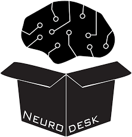
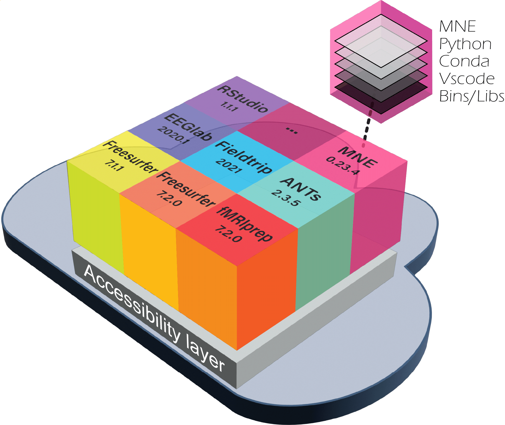
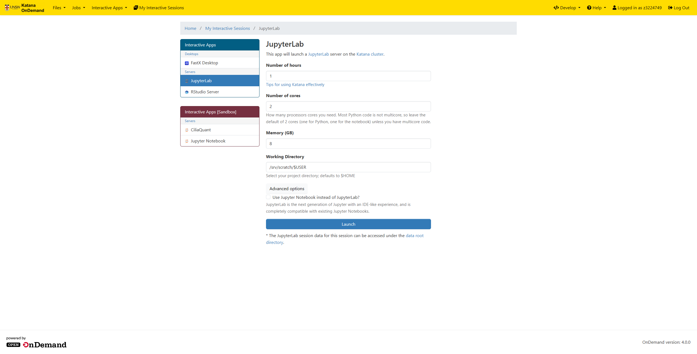
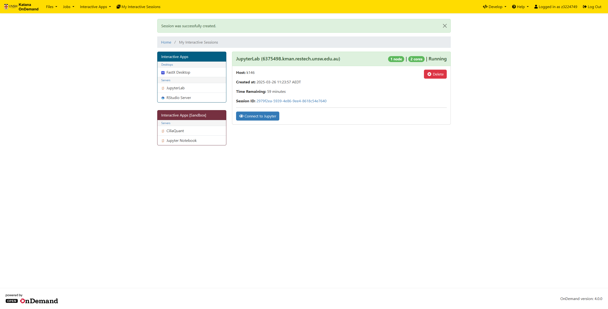
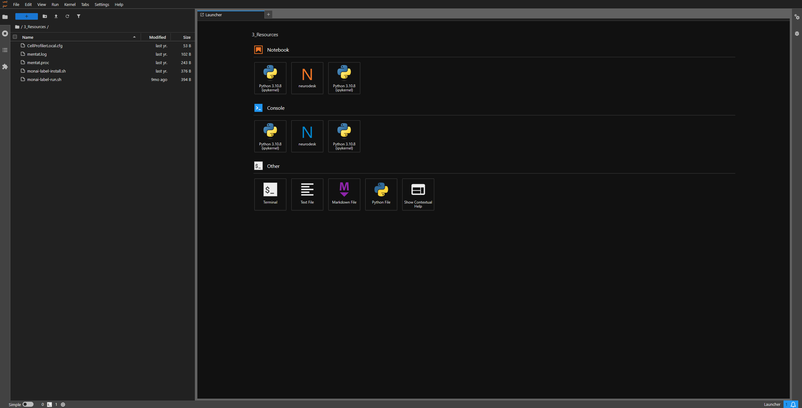

# Neurodesk
[Neurodesk](https://www.neurodesk.org) is a powerful platform designed to make analyzing medical imaging data easier and more reliable. It uses special software packages called containers, which help ensure that your analysis is consistent and reproducible. With Neurodesk, you can easily set up and use these containers to work with your neuroimaging data, making the whole process smoother and more efficient.

<p float="left" align="middle">
  
  
</p>

## Jupyter interactive notebooks

Open up a terminal to execute the following commands.

### Set up your python environment and corresponding jupyter kernel
   ```bash
	# Create and activate environment
	module load python/3.11.3
	python3 -m venv /home/$USER/.venvs/neurodesk
	source /home/$USER/.venvs/neurodesk/bin/activate

	# Install libraries to set up jupyter kernel
	pip install --upgrade pip setuptools
	pip install seaborn numpy nibabel pandas matplotlib ipyniivue
	pip install ipykernel IPython==8.22.2
	deactivate

    # Import desired Neurodesk modules on Katana to your virtual environment
	module purge
	module load neurodesk/use
	# Here is where you'll load your chosen Neurodesk modules
	module load neurodesk/qsmxt/7.2.2
	module load neurodesk/mrtrix3/3.0.3
	module load python/3.11.3

	# Convert virtual environment to jupyter kernel
	source /home/$USER/.venvs/neurodesk/bin/activate
	jupyter_kernel_from_env neurodesk
   ```
!!! note
	To install Neurodesk containers as modules to be used in Katana, please contact our service desk at [restech.support@unsw.edu.au](mailto:restech.support@unsw.edu.au)
	from your UNSW email account with details of what software change you require.

### Start a JupyterLab instance on Katana

1. Log into Katana OnDemand and select the **JuypterLab**.
	<p float="left" align="middle">
	
	</p>
2. Select **JupyterLab** from the list of applications and choose the desired **Compute Node** and **Walltime**.
	<p float="left" align="middle">
	
	</p>
3. Click **Launch** to start the JupyterLab instance.
4. Once the instance is running, click on the **Launch JupyterLab** button to open the JupyterLab interface in a new tab.
	<p float="left" align="middle">
	
	</p>
5. In the JupyterLab interface, select the **Kernel** menu and choose the kernel you created in step 1 (e.g., `neurodesk`).
	<p float="left" align="middle">
	
	</p>
6. You can now create a new notebook or open an existing one and then selecting the kernel to start working with the Neurodesk environment. An example notebook with [QSMxT](https://www.neurodesk.org/example-notebooks/structural_imaging/qsmxt.html) can be downloaded from the Neurodesk website.

### Running an example Jupyter notebook from Neurodesk

1. Download the example notebook from the Neurodesk website: [QSMxT Example Notebook](https://www.neurodesk.org/example-notebooks/structural_imaging/qsmxt.html).
2. Upload the notebook to your JupyterLab instance. Instructions can be found in the [Storage](../../storage/kdm.md) section.
3. Modify the notebook to work with Katana specifically:
	- Comment out the lmod commands, as the modules are already loaded in the environment from Katana modules.
	<!---[add image or code]--->
	```bash
	# import lmod
	# await lmod.load('qsmxt/7.2.2')
	```
	- Change all instances of AnyNiivue import to NiiVue
	```bash
	# from ipyniivue import AnyNiivue
	from ipyniivue import NiiVue
	# nv_T1 = AnyNiivue()
	nv_T1 = NiiVue()
	```


