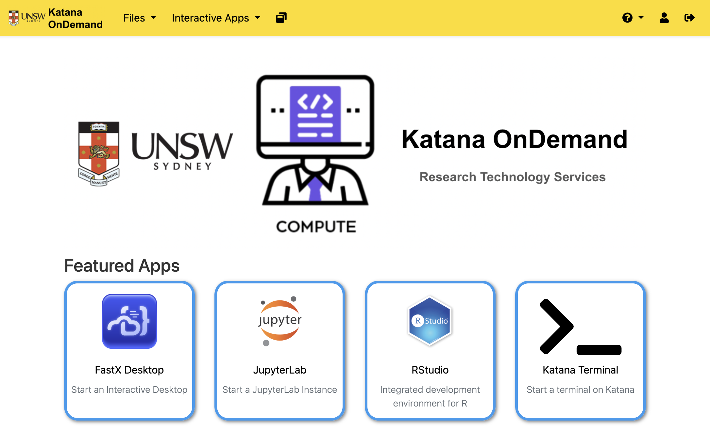
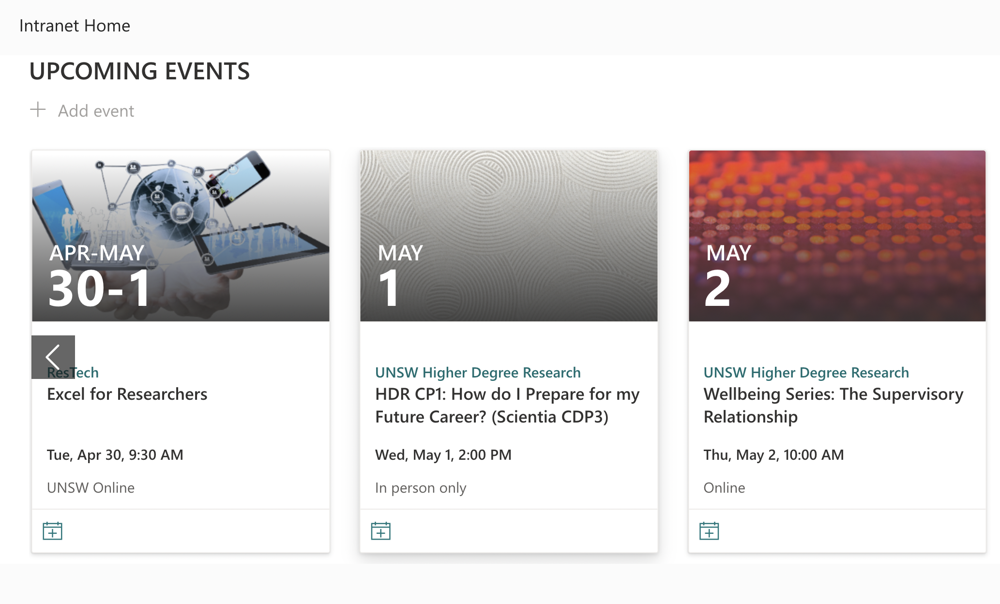

title: Home

# Katana - Shared Computational Cluster at UNSW 

Katana is a computational cluster at UNSW with over 6,000 CPU cores, 8 GPU compute nodes (V100 and A100), 
and 6Pb of disk storage allowing users to run jobs not feasible on personal devices because they take too long,
require too much memory, there is too much data, there is data shared between multiple people, or just too many
calculations that need to be run. See [details](/using_katana/about_katana) for more information about Katana.

Information on how to request a Katana account can be found with the
[information on how to access Katana](using_katana/accessing_katana/#requesting-an-account).

<figure markdown>
  [{ width="800" }](https://unsw.sharepoint.com/sites/restech){:target="_blank"}
</figure>

## Are you looking for....

    

      

            
            
<a href="/using_katana/ondemand">Web based access to Katana</a>

        </a>
      

    

    

      

            
            
<a href="https://unsw.sharepoint.com/sites/restech" target="_blank">ResTech training (including Katana)</a>

        </a>
      

    

    

      

            
            
<a href="help_support/user_support">Getting help and support</a>

        </a>
      

    

## **Katana Terms of Use**

Any use of Katana is covered by the [Conditions of Use - UNSW ICT Resources](https://www.it.unsw.edu.au/students/policies/agree_to_rules.html). 

!!! warning
    Katana is NOT suitable for sensitive or highly sensitive data. You should use the UNSW Data Classification scheme to classify your data and learn about managing your research data by visiting the [Research Data Management Hub](https://research.unsw.edu.au/research-data-management-hub).
