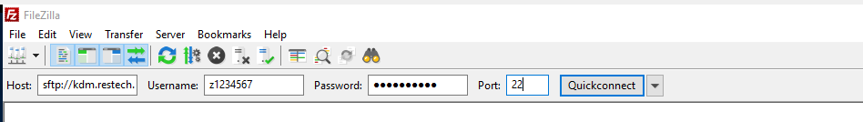

title: Katana Data Mover

Also known as `kdm` or `kdm.restech.unsw.edu.au`

If you have data that you would like to copy to or within the Katana cluster, archive or even compress and decompress you should use the Katana Data Mover - also known as the KDM server - rather than using the head node. This section contains instructions on how to use KDM server.

If you are familiar with using Linux commands to copy or move files then you can do that directly by logging on to `kdm.restech.unsw.edu.au` via `ssh` in the same way that you would log in to Katana and then use the `cp`, `mv` and `rsync` commands that you would normally use under Linux.

If you are not familiar with using the Linux command line for moving or copying files then the easiest way to move files around is to use client software such as FileZilla_. Once you have connected to `kdm.restech.unsw.edu.au` using your zID and zPass you should see a remote view which corresponds to the files sitting on Katana. You can then use the FileZilla interface to move files and folders around.

!!! note
    We require people to "move data" through the data mover. We have hundreds of users, most of whom have data ranging from very large to impossibly large. This is why we have the `kdm`. If you are transferring a couple of small text files - job scripts for instance - you can copy directly to the Katana. But we would ask you to keep it to a minimum, and nothing bigger than 2-3 MB.

## Copying Files To and From a Cluster

The method of transferring files to and from clusters depends on your local machine. If you are a Linux user then you should use rsync and if you are a Windows user then you should download and install WinSCP or FileZilla

!!! warning
    Filezilla is often marked as being a security risk. There is nothing that Research Technology Services can do about that - it's an issue for UNSW IT, Symantec, and FileZilla. If this happens to you, please try WinSCP - it's very good.

### Filezilla

Once you have installed Filezilla you can go into the site manager and create a new site in the site manager using the settings below.

<figure markdown>
  { width="400" }
  <figcaption>filezilla site manager</figcaption>
</figure>

You can also use the Quick Connect bar as shown here: 

<figure markdown>
  { width="400" }
  <figcaption>filezilla quick connect</figcaption>
</figure>

### From my computer to Katana Home

To copy the directory `/home/1234567/my-directory` from your local computer to Katana scratch. The trailing `:` is important!

``` bash
me@localhost:~$ rsync -avh /path/to/my-directory z1234567@kdm.restech.unsw.edu.au:
```

### From my computer to Katana Scratch

``` bash
me@localhost:~$ rsync -avh /path/to/my-directory z1234567@kdm.restech.unsw.edu.au:/srv/scratch/z1234567
```

### From Katana to my computer

First, you need to make sure the data is in either your Home directory or your scratch 

If the data is in `/home/z1234567/my-remote-results` and you want it in your home directory:

``` bash
me@localhost:~$ rsync -avh z1234567@kdm.restech.unsw.edu.au:my-remote-results /home/me/
```

If the data is in `/srv/scratch/my-remote-results` and you want it in your home directory:

``` bash
me@localhost:~$ rsync -avh z1234567@kdm.restech.unsw.edu.au:/srv/scratch/my-remote-results /home/me
```

!!! note
    [TMUX](../software/tmux.md) is available if your data is large and the rsync might take a long time.


## Mounting University Provided Space on KDM

The university provides a large amount of space if you need. You can find more information about `staff storage` on the `UNSW website`.

[Filezilla](https://filezilla-project.org/)

[WinSCP](https://winscp.net/eng/download.php)

[staff storage](https://www.myit.unsw.edu.au/services/staff/storage-staff)

[UNSW website](https://www.myit.unsw.edu.au/services/staff/storage/fsam-staff)
