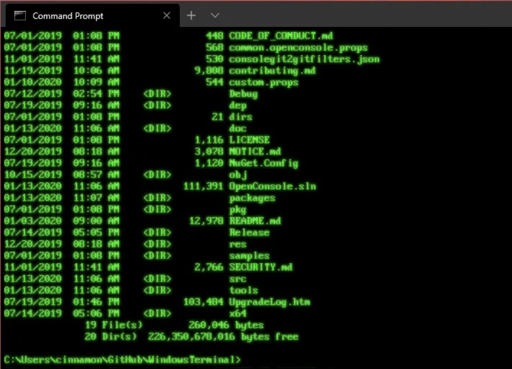

title: Accessing Katana

## Requesting an Account

To apply for an account, please send an email to [restech.support@unsw.edu.au](mailto:restech.support@unsw.edu.au), giving your zID, your role within UNSW and the name of your supervisor or head of your research group.

Anyone at UNSW can apply for a general account on Katana. This level is designed for those that think Katana would suit their research needs or will typically use less than 10,000 CPU hours a quarter. This level still gets access to the same level of support including software installation, help getting started or running their jobs. The only difference is the number of compute jobs that can be run at any time and how long they can run for - general users can only use a 12 hour [Walltime](../../help_support/glossary#walltime).

If your needs require more CPU hours or consulation, some Faculties, Schools and Research Groups have invested in Katana and have a higher level of access. Users in this situation should speak to their supervisor.

## Accessing Katana

<div style="display: flex; justify-content: space-around;">
    <div style="flex: 1; margin: 0 10px;">
        <div style="display: inline-block; text-align: center;">
            <a href="/using_katana/ondemand"></a>
            <div><a href="/using_katana/ondemand">Via Web/Graphical Session</a></div>
        </div>
    </div>
    <div style="flex: 1; margin: 0 10px;">
        <div style="display: inline-block; text-align: center;">
            <a href="/using_katana/accessing_katana/#connecting-to-katana-via-terminal"></a>
            <div><a href="/using_katana/accessing_katana/#connecting-to-katana-via-terminal">Via Terminal</a></div>
        </div>
    </div>
</div>
 


## Connecting to Katana via Terminal

!!! note "Operating System"
    === "Linux and Mac"
        From a Linux or Mac OS machine you can connect via ssh in a terminal:

        ``` bash
        laptop:~$ ssh z1234567@katana.restech.unsw.edu.au
        ```
    === "Windows"
        From a Windows machine an SSH client such as [Putty](https://www.chiark.greenend.org.uk/~sgtatham/putty/latest.html) or [MobaXTerm](https://mobaxterm.mobatek.net/) is required. 

        If you are comfortable using PowerShell, OpenSSH is available on recent Windows versions. If not present, it can be [installed on Windows 10](https://docs.microsoft.com/en-us/windows-server/administration/openssh/openssh_install_firstuse). 

    === "Windows subsystem for Linux (WSL)"
        You can run a Linux environmet directly on Windows using [Windows Subsystem for Linux](https://docs.microsoft.com/en-us/windows/wsl/about) (WSL).

        There are two ways to install WSL on your system:

        1. On UNSW Windows standard operating environment (SOE) machines you can open the [Company Portal](https://www.microsoft.com/en-au/p/company-portal/9wzdncrfj3pz?activetab=pivot:overviewtab) App and from there install one of the [Linux distrubtions](https://www.makeuseof.com/linux-distros-for-windows-subsystem-for-linux/) through the 'Apps', the same as you would other applications.
        2. Manually enable [WSL in PowerShell](https://docs.microsoft.com/en-us/windows/wsl/install-win10) and then install a Linux distribution through the Microsoft Store. 

        Using WSL will not only let you connect to katana with SSH, but also provides many GNU/Linux tools that are useful when working with HPC and research data.


## SSH KeepAlive

To stop your connection disconnecting after some idle time, you can send some empty packets to keep your session alive. You want to change the
frequency of these packets from 0 (none) to a small time interval, say 60 seconds. The configuration differs depending on the SSH client used.

On PuTTy: Category -> Connection -> "Seconds between keepalives"

On MobaXterm: Settings -> Configuration -> SSH -> SSH keepalive 

On Linux and WSL you send keepalive packets for all servers by editing ~/.ssh/config and adding the lines 

``` bash

   Host *
      ServerAliveInterval 60

```