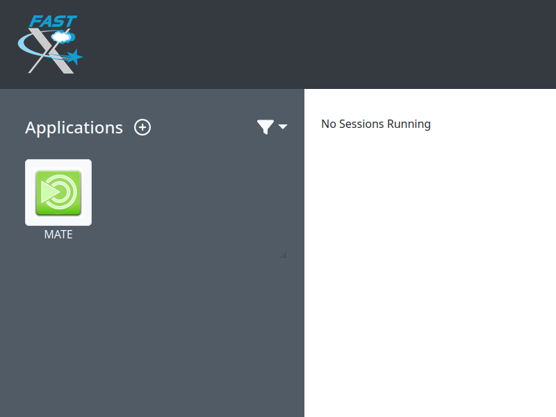

title: Accessing Katana

Anyone at UNSW can apply for a general account on Katana. This level is designed for those that think Katana would suit their research needs or will typically use less than 10,000 CPU hours a quarter. This level still gets access to the same level of support including software installation, help getting started or running their jobs. The only difference is the number of compute jobs that can be run at any time and how long they can run for - general users can only use a 12 hour [Walltime](../glossary.md#walltime).

If your needs require more CPU hours or consulation, some Faculties, Schools and Research Groups have invested in Katana and have a higher level of access. Users in this situation should speak to their supervisor.

## Requesting an Account

To apply for an account you can send an email to the [UNSW IT Service Centre](mailto:ITServiceCentre@unsw.edu.au) giving your zID, your role within UNSW and the name of your supervisor or head of your research group.


## Connecting to Katana

!!! info
    When you are connecting to Katana via `katana.restech.unsw.edu.au` you are connecting to one of two login nodes `katana1.restech.unsw.edu.au` or `katana2.restech.unsw.edu.au`. If you have a long running [Tmux](../software/tmux.md) open, you will need to login to the node on which it was started.

!!! note "Platform"
    === "Linux and Mac"
        From a Linux or Mac OS machine you can connect via ssh in a terminal:

        ``` bash
        laptop:~$ ssh z1234567@katana.restech.unsw.edu.au
        ```
    === "Windows"
        From a Windows machine an SSH client such as [Putty](https://www.chiark.greenend.org.uk/~sgtatham/putty/latest.html) or [MobaXTerm](https://mobaxterm.mobatek.net/) is required. 

        If you are comfortable using PowerShell, OpenSSH is available on recent Windows versions. If not present, it can be [installed on Windows 10](https://docs.microsoft.com/en-us/windows-server/administration/openssh/openssh_install_firstuse). 

    === "Windows subsystem for Linux (WSL)"
        You can run a Linux environmet directly on Windows using [Windows Subsystem for Linux](https://docs.microsoft.com/en-us/windows/wsl/about) (WSL).

        There are two ways to install WSL on your system:

        1. On UNSW Windows standard operating environment (SOE) machines you can open the [Company Portal](https://www.microsoft.com/en-au/p/company-portal/9wzdncrfj3pz?activetab=pivot:overviewtab) App and from there install one of the [Linux distrubtions](https://www.makeuseof.com/linux-distros-for-windows-subsystem-for-linux/) through the 'Apps', the same as you would other applications.
        2. Manually enable [WSL in PowerShell](https://docs.microsoft.com/en-us/windows/wsl/install-win10) and then install a Linux distribution through the Microsoft Store. 

        Using WSL will not only let you connect to katana with SSH, but also provides many GNU/Linux tools that are useful when working with HPC and research data.


## SSH KeepAlive

To stop your connection disconnecting after some idle time, you can send null packets to keep your session alive. You want to change the frequency of these packets from 0 (none) to a small time interval, say 60 seconds. The configuration differs depending on the SSH client used.

On PuTTy: Category -> Connection -> "Seconds between keepalives"

On MobaXterm: Settings -> Configuration -> SSH -> SSH keepalive 

On Linux and WSL you send keepalive packets for all servers by editing ~/.ssh/config and adding the lines 

``` bash

   Host *
      ServerAliveInterval 60

```

## Graphical sessions

!!! warning
    Please use [Katana OnDemand](./ondemand.md) (kod.restech.unsw.edu.au) if available for your application. It is significantly easier to use for newcomers. 

Some software - [Ansys](../software/ansys.md), [Jupyter Notebooks](../software/jupyter-notebooks.md), [Matlab](../software/matlab.md), [R and RStudio](../software/r.md) being among the most popular - are easier with a graphical session.
If you require an interactive graphical session to Katana then you can use either the FastX web or desktop client.

### FastX web client

Katana graphical sessions can be started at [https://katana.restech.unsw.edu.au](https://katana.restech.unsw.edu.au).

Login and double click the `MATE` entry on the left.

<figure markdown>
  { width="400" }
  <figcaption>FastX applications</figcaption>
</figure>

Select which login server to start your session on, or leave it on automatic.

<figure markdown>
  { width="400" }
  <figcaption>FastX server list</figcaption>
</figure>


### FastX desktop client

The FastX desktop client can be downloaded from [https://www.starnet.com/download/fastx-client](https://www.starnet.com/download/fastx-client)

Start FastX and create a session for Katana. The details that you need to enter for the session are:

``` bash
Host: katana.restech.unsw.edu.au
User: zID
Name: Katana
```

<figure markdown>
  { width="418" }
  <figcaption>FastX connection settings</figcaption>
</figure>


<!-- !!! note ""
    If you have connected from a Linux machine (or a Mac with X11 support via X11.app or XQuartz) then connecting via SSH will allow you to open graphical applications from the command line. To run these programs you should start an interactive job on one of the compute nodes so that none of the computational processing takes place on the head node. -->

!!! warning
    The usability of a graphical connection to Katana is highly dependent on network latency and performance.

Once you have logged into a Katana desktop, you should start a terminal 


<figure markdown>
  { width="400" }
  <figcaption>FastX desktop view</figcaption>
</figure>


Then run an interactive session. Here you can see a command similar to what you would run for an interactive session with 8 CPUs and 16 GB for one hour. You will probably need more time. You can tell your interactive session has started when you see the name of the machine change - in this image I am on k247.

``` bash
qsub -I -X -l select=1:ncpus=8:mem=16gb,walltime=1:00:00
```

<figure markdown>
  { width="600" }
  <figcaption>FastX terminal view</figcaption>
</figure>

Once that's started, you can load the modules and run the command line name of the software you want. That is how you run Graphical Interfaces or GUIs using Katana's grunt.


<!-- <figure markdown>
  { width="400" }
  <figcaption>FastX rstudio view</figcaption>
</figure> -->
