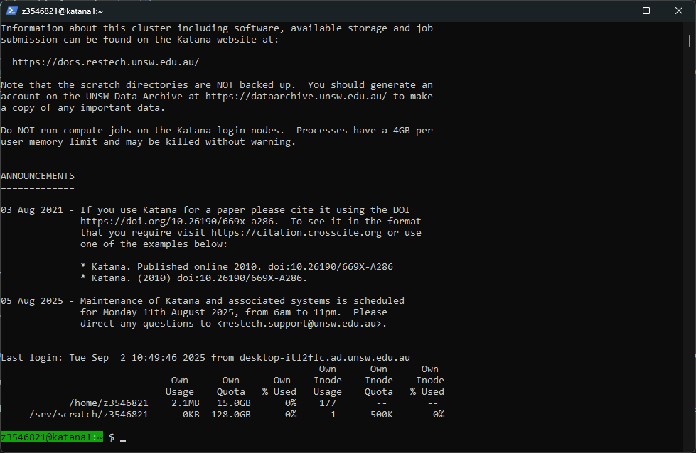
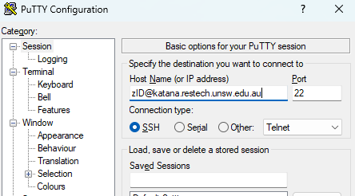
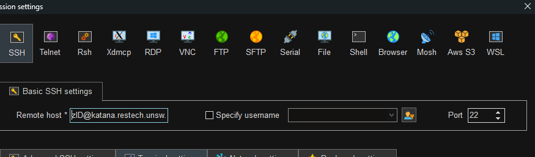

title: Accessing Katana

## Requesting an Account

To apply for an account, please fill out the ServicePoint form [Katana Access Request](https://servicepoint.unsw.edu.au/casm.html#/bui/home/search?selectedCategoryId=pcat:433408&selectedCategoryName=Katana%20Access%20Request),
including your role within UNSW and the name of your supervisor or head of your research group.

Anyone at UNSW can apply for a general account on Katana if they think that Katana would suit their research needs and will typically use 
less than 10,000 CPU core hours a quarter. If a researcher requires or uses more than that they should also give consideration to using NCI.

All Katana users gets access to [help with software installation, getting started on Katana or running their jobs](../../help_support/user_support/). 

The only difference between Katana users is the number of compute jobs that can be run at any time and how long they can run for - general 
users can only use a 12 hour [Walltime](../../help_support/glossary#walltime).

If your needs require more CPU hours or consulation, some Faculties, Schools and Research Groups have invested in Katana and have a higher level of access.
Users in this situation should speak to their supervisor.

## Accessing Katana

<div style="display: flex; justify-content: space-around;">
    <div style="flex: 1; margin: 0 10px;">
        <div style="display: inline-block; text-align: center;">
            <a href="/using_katana/ondemand"></a>
            <div><a href="/using_katana/ondemand">Via Web/Graphical Session</a></div>
        </div>
    </div>
    <div style="flex: 1; margin: 0 10px;">
        <div style="display: inline-block; text-align: center;">
            <a href="/using_katana/accessing_katana/#connecting-to-katana-via-terminal"></a>
            <div><a href="/using_katana/accessing_katana/#connecting-to-katana-via-terminal">Via Terminal</a></div>
        </div>
    </div>
</div>
 


## Connecting to Katana via Terminal

!!! note "Operating System"
    === "Linux and Mac"
        From a Linux or Mac OS machine you can connect via ssh in a terminal:

        Launch Terminal on your Mac OS or Linux computer, and run:

        ``` bash
        laptop:~$ ssh z1234567@katana.restech.unsw.edu.au
        ```
    === "Windows"
        From a Windows machine an SSH client such as [Putty](https://www.chiark.greenend.org.uk/~sgtatham/putty/latest.html) or [MobaXTerm](https://mobaxterm.mobatek.net/) is required. 

        In Putty/MobaXTerm, use `zID@katana.restech.unsw.edu.au` as host name.

        Putty: 

        
        
        Moba: 

        
        
        Then click on Open, and accept to trust the identity of server.

        If you are comfortable using PowerShell, OpenSSH is available on recent Windows versions. If not present, it can be [installed on Windows 10/11 or Windows Server](https://docs.microsoft.com/en-us/windows-server/administration/openssh/openssh_install_firstuse). 

        ``` powershell
        C:\Windows\system32> ssh z1234567@katana.restech.unsw.edu.au
        ```

        Enter your zPass to connect.


    === "Windows subsystem for Linux (WSL)"
        You can run a Linux environmet directly on Windows using [Windows Subsystem for Linux](https://docs.microsoft.com/en-us/windows/wsl/about) (WSL).

        There are two ways to install WSL on your system:

        1. On UNSW Windows standard operating environment (SOE) machines you can open the [Company Portal](https://www.microsoft.com/en-au/p/company-portal/9wzdncrfj3pz?activetab=pivot:overviewtab) App and from there install one of the [Linux distrubtions](https://www.makeuseof.com/linux-distros-for-windows-subsystem-for-linux/) through the 'Apps', the same as you would other applications.
        2. Manually enable [WSL in PowerShell](https://docs.microsoft.com/en-us/windows/wsl/install-win10) and then install a Linux distribution through the Microsoft Store. 

        Using WSL will not only let you connect to katana with SSH, but also provides many GNU/Linux tools that are useful when working with HPC and research data.

