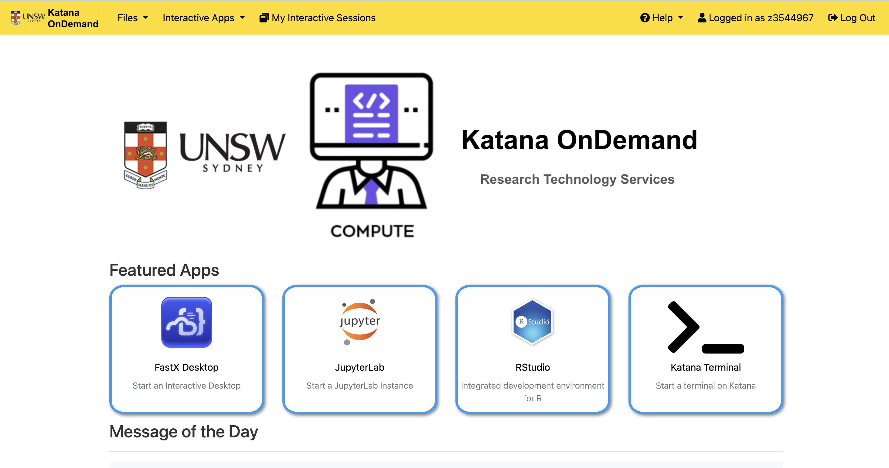
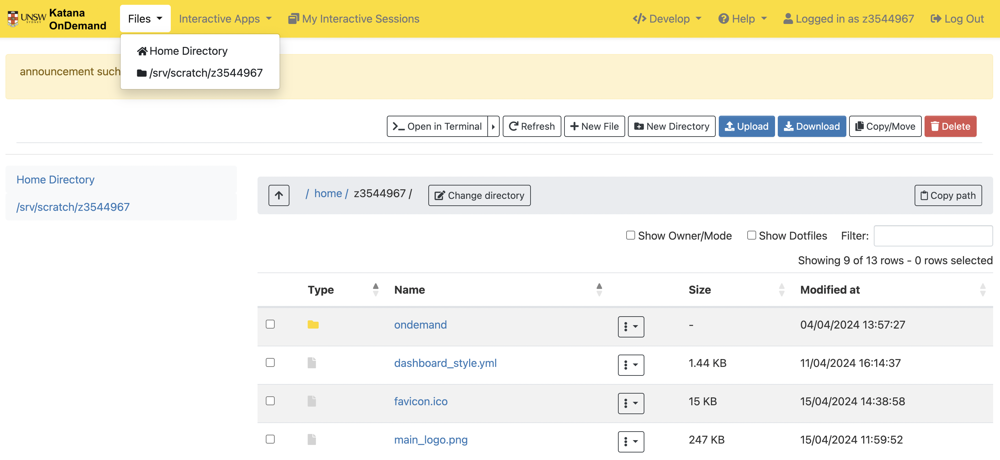

title: Web access to Katana

# Katana OnDemand

[Katana OnDemand](https://kod.restech.unsw.edu.au){:target="_blank"} gives you web interface to Katana

If you are not on campus, please make sure you are connected to [UNSW VPN](https://vpn.unsw.edu.au){:target="_blank"}.

<figure>
    
  <figcaption>
    <a href="https://kod.restech.unsw.edu.au" target="_blank">Katana OnDemand</a>
  </figcaption>
</figure>

## Access your files

On Katana OnDemand, you can easily **upload**, **download**, **delete** and **modify** files

<figure markdown>
  { width="800" }
</figure>

## Interactive Apps

You can run [Virtual Desktop](../software/virtual_desktop), [JupyterLab](../software/jupyter-notebooks), [RStudio](../software/r), Terminal Session of Katana on your web browser.

The status of your interactive sessions can be seen using the rightmost 'My Interactive Sessions' icon. 

  <video width="800" controls>
    <source src="../../assets/interactive_session_demos.mp4" type="video/mp4">
    Your browser does not support the video tag.
  </video>

