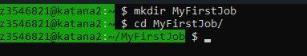
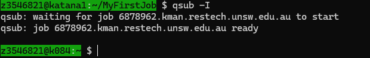

# Running Jobs on Katana

## Brief Overview

Katana is a High Performance Computing (HPC) cluster. It allows users to run computationally intensive programs on powerful compute nodes. **Login nodes** are only for preparing, submitting, and managing jobs—not for heavy calculations.

<figure markdown>
  { width="800" }
  <figcaption>Simple HPC Architecture</figcaption>
</figure>

**⚠ Warning:** Do not run computationally intensive processes on **login nodes**; use **compute nodes** instead.

Jobs are submitted from the login node, which delivers them to the **Head Node** for job and resource management. Once resources are allocated, the job will run on one or more compute nodes.

Katana uses OpenPBS to manage resources and schedule jobs.

### Job Types

- **Batch Job** – Runs a scripted job automatically from start to finish without user intervention. Ideal for long-running production tasks.
- **Interactive Job** – Provides a live shell session on compute nodes for experimentation and debugging. Useful for testing and planning batch jobs.  

All jobs enter a **queue** while waiting for resources.

### Resources

Main resources requested by jobs:

- **Memory (RAM)**  
- **CPU cores**  
- **Walltime** (time for CPUs)  

> Note: Increasing memory, CPU cores, or walltime may limit the available queues. See the queue limits below.

---

## Create a Job Folder

Create a dedicated folder for your job files. This keeps your work organized and makes it easier to manage multiple jobs.

```bash
mkdir MyFirstJob
```
Then navigate into the folder:

```bash
cd MyFirstJob
```
<div style="flex: 1; margin-right: 20px;">
		
</div>

## Create a script or program to run

Before submitting a job, you need a script or program to execute. This could be a compiled binary, a Python script, an R script, or any other executable file.
For example, create a simple Python script named `myprogram.py`:
```bash
nano myprogram.py
```

Inside nano, add the following code:

```python
print("Hello, Katana!")
```
Save this file and exit nano (CTRL+S, ENTER, CTRL+X).

## Batch Jobs (qsub)

A batch job is a script that runs autonomously on a compute node. The script specifies resources and commands to run. Now you will create a job script to run the program you created.

### Step 1: Create a Job Script File

```bash
# Create a new file called myjob.pbs
nano myjob.pbs
```

<div style="display: flex; justify-content: space-around;">
    <div style="flex: 1; margin: 0px;">
        <div style="display: inline-block; text-align: center;">
            
            <div>Windows Powershell</div>
        </div>
    </div>
</div>

This opens a simple text editor in the terminal:

<div style="flex: 1; margin-right: 20px;">
		
</div>

Copy the following template into the editor:

```bash
#!/bin/bash

#PBS -l select=1:ncpus=1:mem=4gb
#PBS -l walltime=12:00:00
#PBS -M zID@ad.unsw.edu.au
#PBS -m ae
#PBS -j oe

cd $PBS_O_WORKDIR

python3 myprogram.py
```

<div style="flex: 1; margin-right: 20px;">
		
</div>

!!! note
	What each line does:

	```bash
	#!/bin/bash
	```

	Tells the system to use the Bash shell to run your script. Every script should start with this line.

	```bash
	#PBS -l select=1:ncpus=1:mem=4gb`
	```

	Requests 1 compute node with 1 CPU core and 4GB RAM. The scheduler uses this to allocate resources. You can adjust `ncpus` and `mem` as needed.

	```bash
	#PBS -l walltime=12:00:00
	```

	Sets the maximum run time to 12 hours. See the Walltime section below for more details.

	```bash
	#PBS -M your.name.here@unsw.edu.au
	#PBS -m ae
	```

	(Optional)Sends an email notification if the job aborts (a) or ends normally (e). Useful to know when your job finishes or fails. 

	```bash
	#PBS -j oe
	```

	(Optional)Combines the standard output and standard error into a single file, making it easier to review the results.

	```bash
	cd $PBS_O_WORKDIR
	```

	Changes the working directory to where you ran qsub. This ensures you are running in the correct folder.

	```bash
	python3 myprogram.py
	```

	Runs your program. Replace myprogram with the actual program or script you want to execute.

- Press `CTRL+S` to save and `CTRL+X` to exit `nano`.

### Step 2: Submit the Batch Job

```bash
qsub myjob.pbs
```

- Terminal will return a job ID (e.g., `1239.kman.restech.unsw.edu.au`)  
- Scheduler will run the job when resources are available.
- When the job is finished, two files will be created in your folder: `myjob.o1239` and `myjob.e1239` (where `1239` is your job ID). The `.o` file contains standard output, and the `.e` file contains any error messages. You can use `cat`, `less`, or `nano` to view these files.
- To check the status of your job, use:

```bash
qstat job_id (e.g., qstat 6787878)
```

---

## Interactive Jobs (qsub -I)

Interactive jobs let you run commands directly on Katana’s compute nodes (not the login node). This is useful when:

- You need to test software before creating a batch script.
- You want to debug or profile code in a live environment.
- You are running short, exploratory tasks where you need to see output in real time.

!!! note
	Interactive jobs are not suitable for long-running tasks. Use batch jobs for production workloads.
	Do not run heavy computations on the login node. Always request an interactive session so your work runs on compute resources.

### Starting an Interactive Session

To start an interactive job, use qsub -I with resource requests. For example:

```bash
qsub -I 
or 
qsub -I -l select=1:ncpus=2:mem=8gb -l walltime=02:00:00
```

<div style="flex: 1; margin-right: 20px;">
		
</div>

!!! mote
	Without resource requests, the default is 1 CPU core, 4GB RAM, and 1 hour walltime.

Once your session starts, you will be logged into a compute node. You can run commands as you would on the login node.

## Understanding Walltime

Walltime is the maximum amount of real time that your job is allowed to run on the cluster. It is requested when you submit a job and is used by the scheduler to plan resources.

- Walltime is specified in hours, minutes, and seconds, the default walltime is 1 hour if not specified in script.
- If your job runs longer than the walltime, it will be terminated automatically, even if it hasn’t finished.
- Walltime affects which queues your job can be scheduled on. Shorter walltime jobs usually start faster, while longer jobs may only be able to run on specific nodes.
- Always estimate your job’s runtime carefully. If unsure, it’s safer to slightly overestimate but not excessively, as very long walltime requests may reduce scheduling priority.
- For long workflows, consider splitting tasks into multiple jobs to fit within walltime limits.

---

## Job queue limits summary 

Typical job queue limit cut-offs are shown below. **The walltime is what determines whether a job can be run on any node, or only on a restricted set of nodes.**

<table>
	<tbody>
		<tr>
			<td>Resource</td>
			<td colspan="6">Queue limit cut-offs</td>
		</tr>
		<tr>
			<td>Memory (GB)</td>
			<td>124</td>
			<td>180</td>
			<td>248</td>
			<td>370</td>
			<td>750</td>
			<td>1000</td>
		</tr>
		<tr>
			<td>CPU Cores</td>
			<td>16</td>
			<td>20</td>
			<td>24</td>
			<td>28</td>
			<td>32</td>
			<td>44</td>
		</tr>
		<tr>
			<td rowspan="2">Walltime (hrs)</td>
			<td>12</td>
			<td>48</td>
			<td>100</td>
			<td colspan="3">200</td>
		</tr>
		<tr>
			<td>Any node</td>
			<td colspan="2">School-owned or general-use nodes</td>
			<td colspan="3">School-owned nodes only</td>
		</tr>
	</tbody>
</table>

---

## Restech GitHub Repositories

- [Restech-HPC](https://github.com/unsw-edu-au/Restech-HPC/tree/master/hpc-examples) – Example Katana scripts  
- [UNSW-Data-Archive](https://github.com/unsw-edu-au/UNSW-Data-Archive) – Upload/download scripts  
- [UNSW-eNotebook-LabArchives](https://github.com/unsw-edu-au/UNSW-eNotebook-LabArchives) – LabArchives widgets

---
